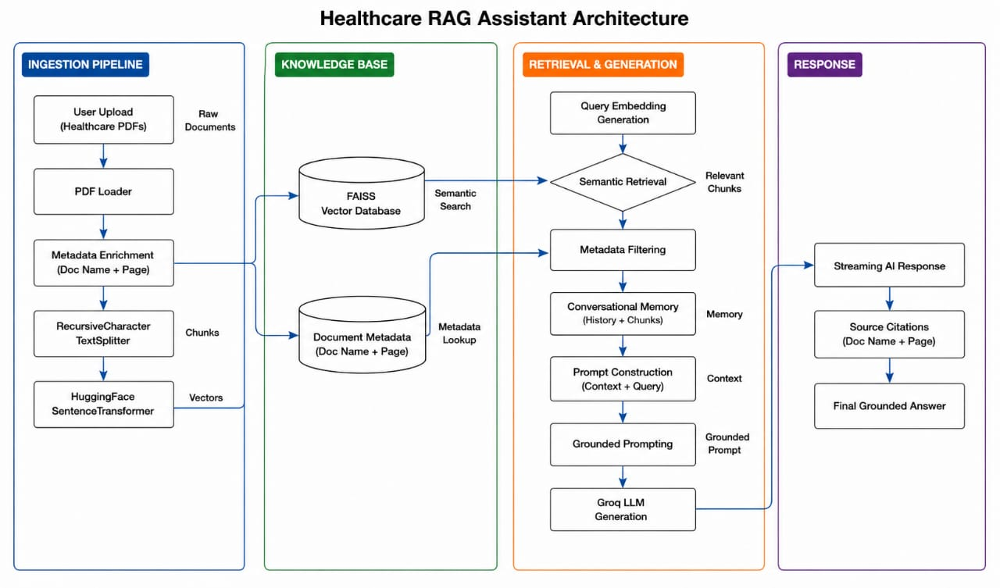

# Healthcare-RAG-Assistant

Healthcare-RAG-Assistant is an advanced Retrieval-Augmented Generation (RAG) based healthcare intelligence system designed to help users retrieve healthcare-related information from medical documents using conversational AI.

The system combines semantic retrieval, conversational memory, metadata filtering, grounded response generation, and streaming responses to provide accurate and document-aware healthcare answers with source citations.

---

# Key Features

- Dynamic PDF Upload
- Multi-Document Retrieval
- Semantic Search using FAISS
- Conversational Context Memory
- Metadata-Based Retrieval Filtering
- Streaming AI Responses
- Grounded Prompting & Hallucination Reduction
- Source Citations with Page References
- Persistent Vector Storage
- HuggingFace Embeddings
- Groq LLM Integration
- Real-Time Vector Database Refresh
- Chat-Based User Interface

---

# System Architecture



---

# System Workflow

The application follows a complete Retrieval-Augmented Generation (RAG) pipeline for healthcare document understanding and conversational question answering.

## Workflow Steps

1. User uploads healthcare PDF documents through the Streamlit interface.
2. PDF Loader extracts healthcare document content.
3. Metadata enrichment attaches:
   - document name
   - page number
4. RecursiveCharacterTextSplitter performs intelligent chunking.
5. HuggingFace sentence-transformers generate embeddings.
6. Embeddings are stored in FAISS Vector Database.
7. User submits healthcare-related queries.
8. Query embeddings are generated using the same embedding model.
9. Semantic retrieval searches relevant chunks using cosine similarity.
10. Metadata filtering optionally retrieves information from specific documents.
11. Conversational memory maintains previous chat context.
12. Prompt construction combines:
    - retrieved chunks
    - conversational context
    - healthcare metadata
    - user query
13. Grounded prompting reduces hallucinations.
14. Groq LLM generates healthcare-aware grounded responses.
15. Streaming responses display answers gradually in real time.
16. Source citations with document name and page number are attached to the final response.

---

# Architecture Components

## Ingestion Pipeline

- PDF Document Loader
- Metadata Enrichment
- RecursiveCharacterTextSplitter
- HuggingFace Embeddings

## Vector & Retrieval Layer

- FAISS Vector Database
- Semantic Retrieval
- Metadata Filtering
- Persistent Local Vectorstore

## Retrieval & Generation Layer

- Conversational Memory
- Query Understanding
- Prompt Construction
- Grounded Prompting
- Groq LLM

## Response Layer

- Streaming Responses
- Chat Interface
- Source Citations
- Final Grounded Response

---

# Tech Stack

| Component | Technology |
|---|---|
| Frontend | Streamlit |
| Framework | LangChain |
| LLM | Groq |
| Embeddings | HuggingFace Sentence Transformers |
| Vector Database | FAISS |
| Programming Language | Python |

---

# Installation

## Clone Repository

```bash
git clone https://github.com/Pavani-D410/Healthcare-RAG-Assistant.git
cd Healthcare-RAG-Assistant
```

---

## Create Virtual Environment

### Windows

```bash
python -m venv venv
venv\Scripts\activate
```

### Linux / Mac

```bash
python3 -m venv venv
source venv/bin/activate
```

---

## Install Dependencies

```bash
pip install -r requirements.txt
```

---

# Environment Variables

Create a `.env` file in the project root directory.

```env
GROQ_API_KEY=your_api_key
```

---

# Run Application

```bash
streamlit run app.py
```

---

# Project Structure

```text
Healthcare-RAG-Assistant/
│
├── app.py
├── requirements.txt
├── .env
├── uploads/
├── vectorstore/
├── healtharchitecture.jpeg
└── .gitignore
```

---

# Challenges Faced

- Large healthcare PDFs increased retrieval latency
- PDF extraction produced noisy formatting and symbols
- Chunk size optimization affected retrieval quality
- Hallucination reduction required grounded prompting
- Conversational memory integration required context management
- Rebuilding embeddings repeatedly affected performance
- Metadata filtering required retrieval optimization

---

# Future Improvements

- Pinecone / ChromaDB Integration
- OCR Support for Scanned Medical Documents
- Re-Ranking Models
- Semantic Chunking
- Voice-Based Healthcare Interaction
- Multilingual Healthcare Support
- RAGAS Evaluation Framework
- Cloud Deployment using AWS/GCP/Azure
- Medical Report Summarization

---

# Author

**Pavani Dangudubiyyam**
